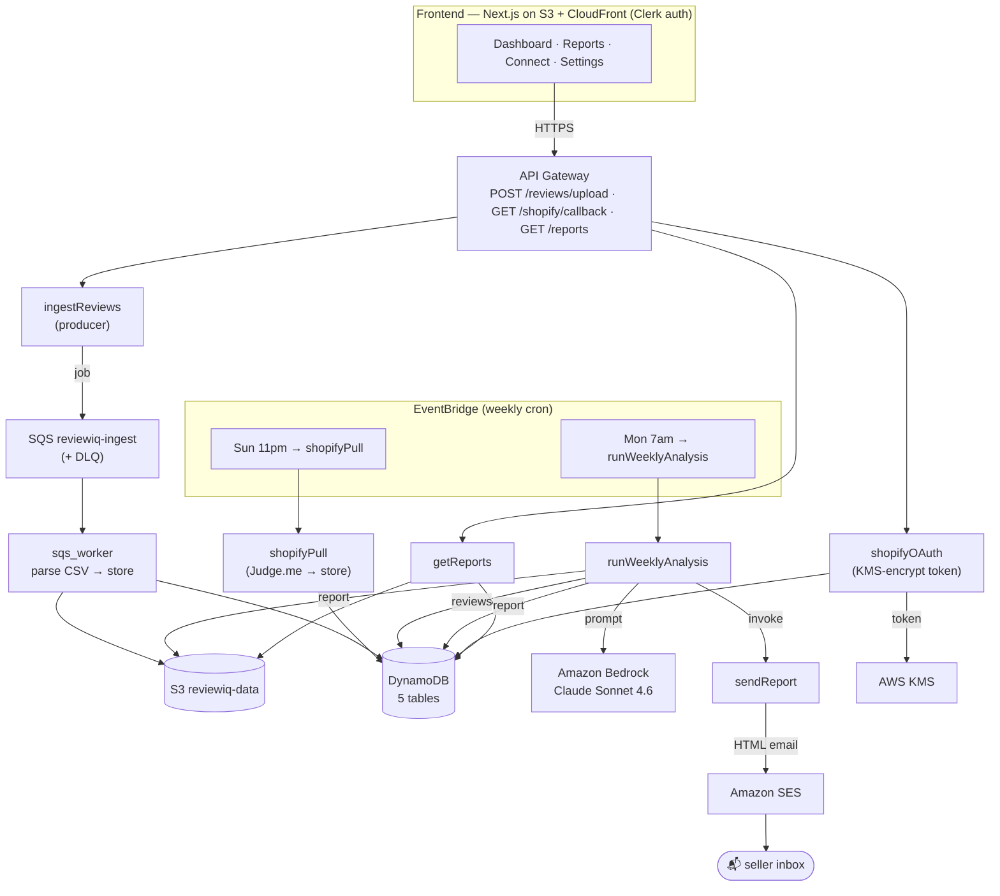

# reviewiq — AI Product Review Intelligence

A fully **serverless AWS application** that ingests e-commerce reviews, analyzes them with
**Amazon Bedrock (Claude)**, and delivers a weekly intelligence report — by email and in a
web dashboard. Built end-to-end on AWS by hand.

> **Live demo:** https://dczo17sidqg5u.cloudfront.net (sign in with Clerk to view the dashboard)

---

## The problem it solves

E-commerce sellers get hundreds of reviews a week and no time to read them. reviewiq reads
every review automatically, finds the patterns with AI, and delivers a prioritized "here's what
to fix and what's working" report every week — zero effort from the seller.

## What it does

1. **Ingest** reviews two ways — CSV/Excel upload, or an automatic weekly Shopify pull.
2. **Analyze** a week of reviews with Claude → sentiment, themes (severity + priority +
   recommended actions), top praises, anomalies, per-product breakdown.
3. **Deliver** the report as an HTML email (SES) and in an authenticated Next.js dashboard.

Everything runs on a weekly schedule with no manual intervention.

---

## Architecture



## AWS services used

| Service | Role |
|---|---|
| **Lambda** | 8 functions — all compute (producer/worker, Shopify OAuth+pull, analysis, email, reports API) |
| **API Gateway** | REST API — upload, Shopify callback, reports |
| **DynamoDB** | 5 on-demand tables — users, stores, reviews, reports, shopify-tokens |
| **S3** | Private data bucket (reviews/reports) + frontend hosting bucket |
| **SQS** | Async ingestion queue + dead-letter queue |
| **Amazon Bedrock** | Claude Sonnet 4.6 for review analysis |
| **KMS** | Encrypts Shopify tokens at rest |
| **SES** | HTML report email delivery |
| **EventBridge** | Weekly cron triggers (analysis + Shopify pull) |
| **CloudFront + S3** | Global CDN hosting for the Next.js frontend (private bucket via OAC) |
| **IAM** | Least-privilege execution role per Lambda |

## Tech stack

- **Backend:** Python 3.13 Lambdas (arm64), `boto3`
- **AI:** Amazon Bedrock — Claude Sonnet 4.6 (`us.anthropic.claude-sonnet-4-6`)
- **Frontend:** Next.js 14 (App Router, static export), Recharts, Clerk auth
- **Region:** `us-east-1`

---

## Repo structure

```
reviewiq/
├── lambdas/
│   ├── ingest_reviews/       # POST /reviews/upload → SQS (producer)
│   ├── sqs_worker/           # SQS → parse CSV → S3 + DynamoDB (consumer)
│   ├── shopify_oauth/        # GET /shopify/callback → KMS-encrypt token
│   ├── shopify_pull/         # EventBridge → pull reviews → store
│   ├── run_weekly_analysis/  # reviews → Bedrock/Claude → report (+ emails)
│   ├── send_report/          # report → SES HTML email
│   ├── get_reports/          # GET /reports → dashboard data
│   └── hello/                # health-check
│       Each lambda has: lambda_function.py, iam-policy.json, README.md
├── frontend/                 # Next.js dashboard (S3 + CloudFront)
├── sample-data/reviews.csv   # demo CSV
└── docs/                     # architecture + project plan
```

Each Lambda folder documents its own deploy config, IAM policy, and how it was built.

---

## Notable engineering decisions

- **Built by hand, not IaC** — every resource was created via console/CLI as a learning
  exercise (also SAA-C03 exam prep). `template.yaml` remains as a reference.
- **No Knowledge Base / OpenSearch** — OpenSearch Serverless has a ~$350/mo always-on floor,
  the one real cost trap. Product context is injected into the prompt instead. Everything else
  is on-demand/pay-per-use (~$1–5/mo at demo scale).
- **Least-privilege IAM** — each Lambda gets exactly the actions it needs (e.g. the worker can
  `sqs:ReceiveMessage`/`DeleteMessage` + `s3:PutObject` + `dynamodb:PutItem`, nothing more).
- **Decoupled ingestion** — SQS between upload and processing, with a dead-letter queue.
- **Secrets** — Shopify tokens are KMS-encrypted at rest, never logged.

## Known MVP limitations (see `docs/` for the roadmap)

- **Auth on the data API** — `getReports` takes `user_id` from the query string; production
  would derive it from the Clerk JWT.
- **SES sandbox** — emails only send to verified addresses until production access is granted.
- **Shopify/Judge.me** — the OAuth token exchange and review pull are simulated (no registered
  Shopify app yet); the AWS mechanics (KMS, EventBridge, storage) are real.
- **CSV upload** — the pipeline works via the API; live browser upload needs presigned S3 URLs.

---

## License

See [LICENSE](./LICENSE).
