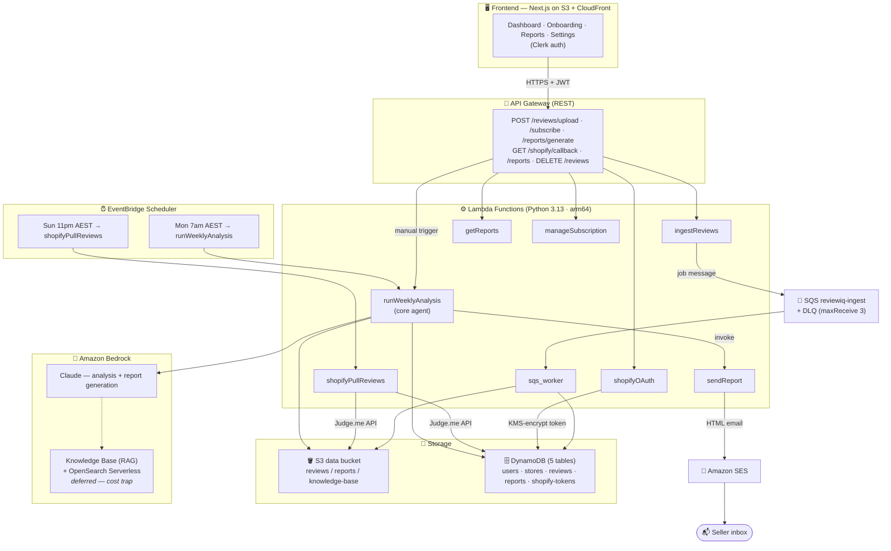

# reviewiq — Architecture & Build Stages

> **AI Product Review Intelligence Agent** — a fully serverless AWS app that ingests
> e-commerce reviews (Shopify + CSV/Excel), analyses them with **Amazon Bedrock (Claude)**,
> and emails a weekly intelligence report.
>
> This document is the one-page mental model. The exhaustive spec lives in
> [`PROJECT_PLAN.md`](./PROJECT_PLAN.md).

---

## The idea in one line

Sellers get hundreds of reviews a week and no time to read them. reviewiq reads every
review automatically, finds the patterns with AI, and emails a prioritised "here's what to
fix and what's working" report every Monday — zero effort from the seller.

---

## System architecture



---

## How reviews get in (3 paths, all merge before analysis)

| Path | Trigger | Flow |
|---|---|---|
| **CSV / Excel upload** | `POST /reviews/upload` | `ingestReviews` → SQS → `sqs_worker` parses → S3 + DynamoDB |
| **Shopify (auto)** | EventBridge Sun 11pm | `shopifyPullReviews` → Judge.me API → S3 + DynamoDB |
| **Shopify connect** | `GET /shopify/callback` | `shopifyOAuth` exchanges code → KMS-encrypt token → DynamoDB |

## How a report gets out (every Monday, automatic)

```
EventBridge (Mon 7am AEST)
  → runWeeklyAnalysis
      → pull last 7 days of reviews from S3 (Shopify + CSV merged)
      → (optional) query Bedrock Knowledge Base for product context
      → Claude returns rich JSON: sentiment, themes, severity, trends, actions
      → compare vs last week → trend + anomaly detection
      → save report to S3 + DynamoDB
      → invoke sendReport
          → render HTML priority table → SES → seller inbox
```

---

## Build stages & current status

| Phase | What it delivers | Status |
|---|---|---|
| **1 — Foundation** | Billing alerts, IAM admin user, 5 DynamoDB tables, S3 bucket, SQS + DLQ, hello Lambda + API Gateway, CloudWatch | ✅ **DONE & LIVE** |
| **2 — Ingestion** | `ingestReviews`, `sqs_worker`, `shopifyOAuth`, `shopifyPullReviews`, EventBridge pull rule | ⬜ **Next** |
| **3 — AI pipeline** | Bedrock model access, `runWeeklyAnalysis`, rich Claude prompt/schema, trend + anomaly detection (Knowledge Base optional) | ⬜ |
| **4 — Automation + email** | SES verify, `sendReport` HTML email, EventBridge weekly rule, manual generate endpoint, CloudWatch alarms | ⬜ |
| **5 — Frontend** | Next.js dashboard (Clerk + Recharts), connect flow, upload UI, reports history, S3 + CloudFront | ⬜ |
| **6 — Polish** | Least-privilege IAM, PDF export, search/filter, unsubscribe, README, demo | ⬜ |

### Phase 1 — deployed resources (verified live)

- **Stack:** `reviewiq` (CloudFormation, `us-east-1`) — `UPDATE_COMPLETE`
- **DynamoDB:** `reviewiq-users`, `-stores`, `-shopify-tokens`, `-reviews`, `-reports` (all PAY_PER_REQUEST)
- **S3:** `reviewiq-databucket-xsytttdtxkh7` (private · AES256 · versioned)
- **SQS:** `reviewiq-ingest` + `reviewiq-ingest-dlq` (maxReceiveCount 3)
- **API:** hello Lambda + API Gateway — health check 200 at `/Prod/hello`

---

## Key decisions (locked)

| Decision | Choice | Why |
|---|---|---|
| **IaC** | AWS SAM (single `template.yaml`, `sam deploy`) | One template, local test, simple CI-less deploys |
| **Runtime** | Python 3.13 on **arm64** | Matches Apple Silicon dev machine; cheaper/faster on Lambda |
| **Bedrock model** | Latest Claude on Bedrock (confirm ID before wiring) | ~$0.15–0.25 per report |
| **Knowledge Base** | **Deferred** — inject product catalogue into the prompt for MVP | OpenSearch Serverless has a ~$350/mo always-on floor — the one real cost trap |
| **Secrets** | Shopify tokens KMS-encrypted at rest, never logged | Security; `user_id` always from Clerk JWT, never client input |

## Cost posture

Everything is on-demand / pay-per-use. At demo scale the whole app runs at roughly
**$1–5/month** plus per-report Bedrock cost — *provided* OpenSearch Serverless stays off.
A `$10/mo` billing budget (`reviewiq-monthly-cost`) alerts at 80% / 100% / forecast.

---

## SAA-C03 study angle

This build doubles as exam prep — each phase maps to an exam domain:

| Domain | Weight | Where it shows up here |
|---|---|---|
| Secure architectures | 30% | IAM least-privilege, KMS token encryption, private S3, JWT auth |
| Resilient architectures | 26% | SQS DLQ, Lambda retries, DynamoDB on-demand |
| High-performing architectures | 24% | CloudFront, async SQS decoupling, Lambda concurrency |
| Cost-optimised architectures | 20% | Serverless pay-per-use, S3 lifecycle, on-demand DB, KB deferral |
